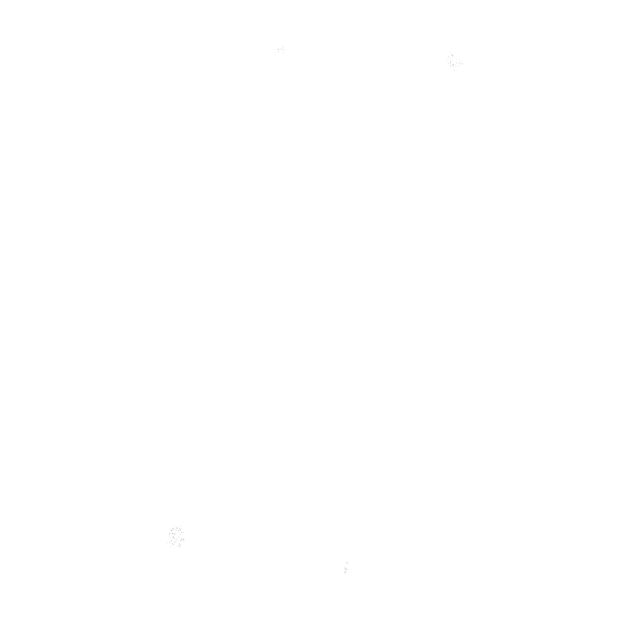

    

# Hello, there ! 👋

I'm a 22-year-old ICT student from Tunisia, specializing in network engineering with a focus on cloud technologies. Welcome to my GitHub profile!

## About Me

- 🔬 Final year student at [ENET'COM](your-university-website), studying Network Engineering.
- 🌐 Passionate about Cloud Technologies, Networking, and Full-stack Development.
- 💼 Experienced in building a wide range of projects, including web apps, mobile apps, desktop apps, and SaaS products.
- 🎨 Skilled in motion graphics, enhancing the front-end user experience.
- 💻 A Full-stack developer with a keen interest in solving complex problems.
- 📚 Constantly learning and keeping up with the latest industry trends.

## Projects

Here are a few noteworthy projects I've worked on:

  <table style="margin: 0 auto;border: none;">
    <tr>
      <td> 
      

          
Details

          

          BMW Connect is a comprehensive system consisting of a mobile app and a server hosted on the BMW vehicle system. This innovative solution enables users to authenticate using their biometrics and gain remote control of their BMW vehicle. Stay connected to your BMW like never before.
          
 
        

      </td>
      <td>
      

          
Details

          

          JSONWave is a SaaS (Software as a Service) platform designed for manipulating, editing, and parsing JSON files in the cloud. With JSONWave, users can streamline their JSON file operations and collaborate seamlessly.

        

      </td>
      <td>
      

          
Details

          

          ECJE App is a professional application tailored for digital agencies. It showcases their services, projects, and technical prowess. Users can explore the agency's portfolio and even place orders for their digital products directly through the app.

        

      </td>
    </tr>
  </table>

 

I'm also actively working on building my [portfolio](link-to-portfolio), where I'll showcase even more of my work. Stay tuned for updates!

**Explore All Repositories:** If you're eager to see all of my projects, feel free to check out my [GitHub profile](https://github.com/Sami-Souissi?tab=repositories). There, you'll find a comprehensive list of my repositories, each highlighting a unique aspect of my skills and experiences.

Feel free to check back soon for my full portfolio. In the meantime, explore these featured projects to get a sense of my skills and experiences.

## Skills

  <table style="margin: 0 auto;">
    <tr>
      <td></td>
      <td></td>
    </tr>
  </table>

- **Version Control:** Git, GitHub.
- **Motion Graphics:** Adobe After Effects, Adobe Premiere Pro.

### Mobile Development

    

### Web Development

    

### Desktop Development

### Cloud Technologies

### Operating Systems

### IoT 

## Let's Collaborate!

I'm always open to new opportunities and collaborations. If you'd like to work together or have any questions, feel free to reach out. Let's make amazing things together!

You can explore my GitHub activity and contributions by visiting my [GitHub profile](https://github.com/sami-souissi).

Thank you for visiting my GitHub profile. Happy coding! 🚀
